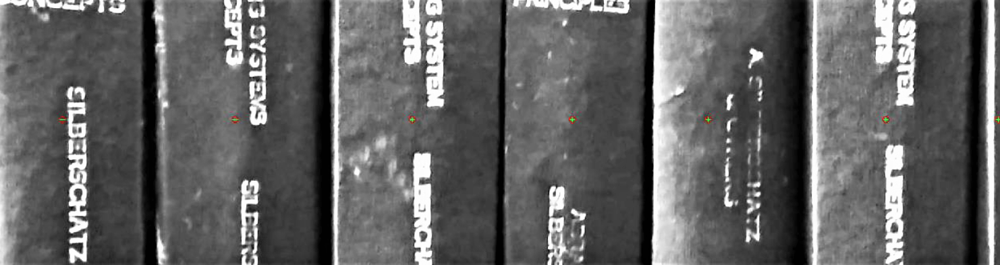

# Object detection and counting

This is a Matlab Mini project involving image processing for object detection from an input video file by processing each frame of the video.

This project takes each frame of the input video file and detects the number of similar objects(in this case Books) present in the frame and determines the object count.

## Programming language used
Matlab

### Concepts:

Blob Analysis

Top-hat Filtering

Morphological structuring element(strel object)
## Screenshots

Output window:

Markers for counting:

## Acknowledgements

 - [Idea of counting object taken from here](https://www.mathworks.com/matlabcentral/fileexchange/22924-count-of-coins)

## Future of this project

This idea can be used to implement autonomous library management system which  decreases human intervention and helps in following covid protocols in libraries.

## Team members

- [K S Abhisheka](https://www.github.com/Abhi-k-s)

- [Lithesh Shetty](https://www.github.com/Shettylithesh)

